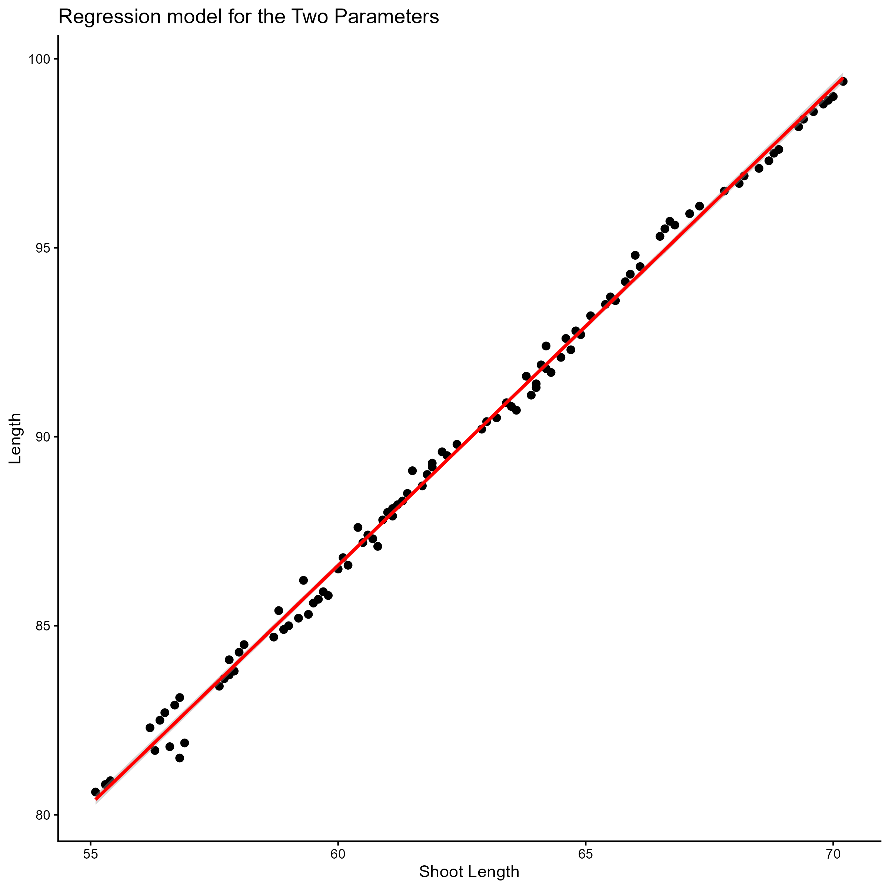
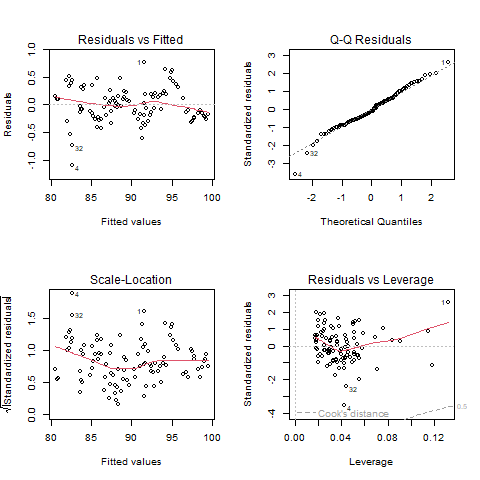

# 🌾 Plant Genotype Phenotypic Analysis in R

> **Measuring 100 plant genotypes and turning trait data into selection decisions** 
> a step-by-step R workflow, from first look at the data to a live decision easy visuals.

*Abiotic Stress Breeder · Trait Selection · Reproducible Pipelines*

[Overview](#-dataset-overview) · [Modules](#-project-modules) · [Workflow](#-workflow-pipeline)

---

## 📊 Dataset Overview

Phenotypic data recorded for **100 plant genotypes** (`G1` – `G100`).
Each genotype is described by one ID and five measured/scored traits:

### 📋 Recorded Variables

| Variable | What it means |
|:---:|---|
| `Genotype` **Genotype ID** | Unique code given to each plant line (`G1` – `G100`) |
| `L` **Length** | Total plant length (height), base to tip in **cm** |
| `B` **Breadth** | Canopy width at its widest point in **cm** |
| `SL` **Shoot Length** | Length of the above-ground shoot in **cm** |
| `RL` **Root Length** | Length of the primary root system in **cm** |
| `LC` **Leaf Colour** | Visual score: *Light Green · Green · Dark Green* |

> 💡 **Field note:** `SL` and `RL` are the standard abbreviations used in seedling-vigor
> research, and `LC` is typically scored against a **Leaf Colour Chart (LCC)** 
> a simple, visual standard developed by IRRI.

---

## 🗂️ Project Modules

Five numbered scripts runnig them in order, each one builds on the previous data.

| SR | Project name | Script name | What it does (in plain words) | Packages |
|:-:|--------|--------|-------------------------------|----------|
| 1 | **Exploratory Data Analysis** | [`exploratory_data_analysis`] | summary stats, correlations, bar & scatter plots | `readxl` `dplyr` `ggplot2` |
| 2 | **ANOVA & Post-Hoc Test** | [`anova_and_posthoc`] | Checks if genotypes truly differ (One-Way ANOVA) and ranks them (Duncan's Test); exports `.png` boxplots | `agricolae` |
| 3 | **Linear Regression** | [`linear_regression`] | Predicts one trait from another, reports R² and residual offsets diagnostics | `stats` `ggplot2` |
| 4 | **Clustering & PCA** | [`genotype_clustering_pca`] | Scales traits (Z-score), groups similar genotypes (K-Means, K = 3), visualizes with PCA biplots | `factoextra` `stats` |
| 5 | **Shiny Dashboard** | [`shiny_dashboard`] | A web app to filter and plot traits — no coding needed to explore | `shiny` `dplyr` `ggplot2` |

### ❓ The Question Each Step Answers

| Step | Question |
|:---:|---|
|  `1` | *What does my data look like?* |
|  `2` | *Are the genotypes really different and which ones are the best?* |
|  `3` | *Can one trait predict another?* *(indirect selection)* |
|  `4` | *Which genotypes are alike and which are diverse enough for crossing?* |
|  `5` | *Can I explore the results without writing code?* |

---

## 🔁 Workflow Pipeline

---
## 📈 Project Results & Showcase
### 3️⃣ Predicting Plant Length Using Linear Regression

**Script:** [`03_linear_regression.R`](./results/03_linear_regression.R)

**Description:**

This module models plant Length (`L`) as a function of the other measured traits to quantify how strongly they are related. Three **simple linear regressions** (predictors: `B`, `SL`, `RL`) and one **multiple linear regression** (`L ~ B + SL + RL`) are fitted on 100 genotypes, followed by residual diagnostics to validate the statistical assumptions of the best model (`α = 0.05`).

---

#### 📊 Results & Outputs

##### Simple Linear Regression — One Trait Predicts Length

*Shows:* How well each single trait explains variation in plant Length (n = 100, df = 98, `α = 0.05`)

**📄 Full Report:** [Download the complete regression output (PDF)](./results/03_linear_regression.pdf)

| Model | Intercept | Slope | Slope SE | t value | Pr(>\|t\|) | R² | Adj. R² | F (1, 98) |
|---|:-:|:-:|:-:|:-:|:-:|:-:|:-:|:-:|
| `L ~ B` | 39.239 | 6.037 | 0.078 | 77.14 | < 2e-16 | 0.9838 | 0.9836 | 5951 |
| `L ~ SL` | 10.706 | 1.265 | 0.008 | 158.47 | < 2e-16 | **0.9961** | **0.9961** | 25110 |
| `L ~ RL` | 21.233 | 2.469 | 0.020 | 125.75 | < 2e-16 | 0.9938 | 0.9938 | 15810 |

`Signif. codes: 0 '***' 0.001 '**' 0.01 '*' 0.05 '.' 0.1 ' ' 1` — all coefficients significant at p < 0.001.

**Key Findings:**

- **Shoot Length (`SL`) is the best single predictor**, explaining **99.61%** of the variation in plant Length (R² = 0.9961, p < 2.2e-16)
- Prediction equation: **L̂ = 10.71 + 1.265 × SL** — each additional 1 cm of shoot corresponds to ~1.27 cm of plant length
- All three traits are individually strong predictors (R² ≥ 0.98) — the growth traits are strongly interdependent

---

##### Multiple Linear Regression — All Three Traits Combined

*Shows:* Whether combining predictors (`L ~ B + SL + RL`) improves prediction over the best single-trait model

| Term | Estimate | Std. Error | t value | Pr(>\|t\|) | Signif. |
|---|:-:|:-:|:-:|:-:|:-:|
| (Intercept) | 13.974 | 1.667 | 8.382 | 4.39e-13 | `***` |
| `B` | 0.202 | 0.322 | 0.625 | 0.5332 | n.s. |
| `SL` | 0.935 | 0.125 | 7.464 | 3.79e-11 | `***` |
| `RL` | 0.565 | 0.234 | 2.412 | 0.0177 | `*` |

Overall fit: **R² = 0.9964**, Adj. R² = 0.9963 · F(3, 96) = 8807, p < 2.2e-16 · Residual SE = 0.316 cm

**Key Findings:**

- **The combined model is highly significant** (p < 2.2e-16) but raises R² only from 0.9961 → **0.9964** compared with `SL` alone
- `SL` (p = 3.79e-11) and `RL` (p = 0.018) remain significant contributors; **`B` becomes non-significant (p = 0.533)** — its information overlaps with the length traits
- **A single, easy field measurement does nearly the whole job** — the full three-trait model is barely better

---

##### Fitted Regression Plot — Shoot Length vs. Length

*Shows:* Scatter plot of `L` ~ `SL` across 100 genotypes with the fitted regression line (ggplot2, 300 dpi)

**Interpretation:**

- Observed values lie close to the fitted line over the entire measurement range (SL ≈ 55–70 cm → L ≈ 80–99 cm) — **the linear model captures the relationship well**
- The association is uniform: each unit increase in shoot length is matched by the same increase in plant length — **a stable, linear relationship with no curvature**
- The tight clustering of points around the line is the visual form of **R² = 0.9961** — almost all variation in plant length is explained by shoot length alone

---

##### Model Diagnostics — Residual Check

*Shows:* Standard `lm` diagnostic panels for the multiple regression: Residuals vs Fitted, Normal Q-Q, Scale-Location, and Residuals vs Leverage with Cook's distance

**Interpretation:**

- **Residuals vs Fitted:** residuals scatter randomly around zero in a flat band — **no systematic pattern**, indicating the linear form is adequate
- **Normal Q-Q:** standardized residuals track the reference diagonal closely — **errors are approximately normal**, with only mild deviation at the tails
- **Scale-Location:** residual spread stays roughly constant across fitted values — **homoscedasticity holds** (predictions are equally reliable for small and large plants)
- **Residuals vs Leverage:** no observation crosses the Cook's distance 0.5 threshold — **flagged genotypes (1, 4, 32) remain within safe limits**, so no single data point dominates the fit

---

#### 🔍 Key Insights from Project 3:

1. **Shoot length predicts plant height almost perfectly:** `SL` alone explained 99.61% of the variation in plant Length (p < 2.2e-16), the strongest single-trait model.
2. **Growth traits share a common vigour signal:** all simple regressions exceeded R² of 0.98, indicating that height, breadth, shoot and root growth are biologically interdependent.
3. **A simple model is sufficient:** expanding the model added almost nothing (ΔR² ≈ +0.0003) — one quick shoot-length measurement predicts plant height with a residual error of only ~0.32 cm, useful for rapid field screening.
4. **Shared variance must be reported:** Breadth (`B`) lost significance when combined with `SL` and `RL` (p = 0.533), indicating overlapping information among size traits; flagged observations (1, 4, 32) warrant review before publication.
5. **Basis for further analysis:** because traits are strongly interdependent, univariate models carry redundant information — multivariate grouping of genotypes is addressed using K-Means clustering and PCA (Project 4).

---
---

**Data → Code → Decision → Results**

*Research Repeat & Reproduce.*
